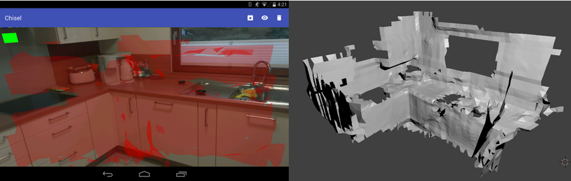
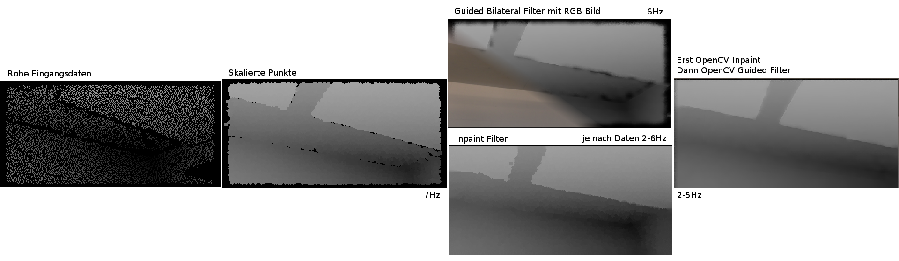
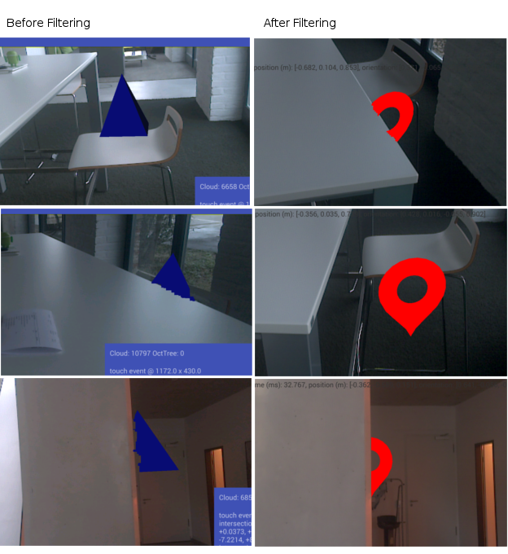

# PoC - Master Thesis [](https://travis-ci.org/stetro/project-tango-poc)

> Optimierung von Augmented Reality Anwendungen durch die Berücksichtigung von Tiefeninformationen mit Googles Project Tango

> Optimization of AR applications with considering the depth information with Googles project tango

## Table of Content
* [Augmented Reality Demo](https://github.com/stetro/project-tango-poc#augmented-reality-ar)
* [Pointcloud Extraction](https://github.com/stetro/project-tango-poc#pointcloud-app-pc)
* [Plane based Reconstruction](https://github.com/stetro/project-tango-poc#plane-based-reconstruction-construct)
* [PCL based native Reconstruction (Greedy Projection Triangulation)](https://github.com/stetro/project-tango-poc#native-implementierung-construct-native)
* [CHISEL based native reconstruction](https://github.com/stetro/project-tango-poc#chisel-open_chisel-implementation-chisel)
* [Unity Marching Cubes AR Demo](https://github.com/stetro/project-tango-poc#unity-implementierung-unity)


## Augmented Reality (ar/)
* AR Camera matching intrinsics
* motion tracking with correct gl positioning
* visualization of the current pointcloud
* ray-intersection for pointcloud interaction
* simple tower defense game with ray intersection
* simple direct pointcloud z-buffer occlusion


## Pointcloud App (pc/)
* collects points into a large pointcloud using an octree
* exports to pts file
* plane based reconstruction applicable
* marching cube reconstruction applicable (usualy to slow here!)


## Plane Based Reconstruction (construct/)
```
1. OctTree clustering of the global pointcloud
2. on incoming depth frame
	* update random n global clusters with points from depth frame
	* use RANSAC to detect 3 planes per cluster
	* project points from 3D space to 2D space (based on detected planes)
	* use Graham Scan to compute comvex hull for each plane
	* use Sweep‐line for triangulation with poly2tri
	* project polygon vertices back to 3D space (based on detected planes)
```
**Video Demonstration**

[](https://www.youtube.com/watch?v=SMg69wIPoxQ)

**Old Screenshots**


## Native PCL based Reconstruction (construct-native/)
* VoxelGrid downsampling
* Greedy Triangulation with PCL
* __Build PCL Library not included__!


## CHISEL `open_chisel` implementation (chisel/)

* online reconstruction using `open_chisel` library
* transformation and interfaces to native environment
* PLY exporter
* __Build open_chisel Library not included__!



## OpenCV Depthmap Generation and Filtering

* generate depthmap using [this](http://stackoverflow.com/questions/34901155/project-tango-depthmap-transformation-from-xyzij-data/34905235#34905235) approach
* applying inpaint and guided filtering for depthmap improvements
* __Build opencv+contrib Library not included__!



**Video Demonstration**

[](https://www.youtube.com/watch?v=D6FcBPK7sYc)

## OpenCV Depthmap Filtering for AR

* using the previous approach for a pointcloud reprojection




## Unity Implementierung (unity/)
* Reconstruction using the MeshBuilder with an simple TSDF by Google
* Implementation of a Clipping Depth Shader
* simple ball moving interaction
* extension of shader for shadowing effects

**Video Demonstration**

[](https://www.instagram.com/p/-9XvFoh_D4/)

**Old Screenshots**


## Verwendete Librarys
* [Rajawali](https://github.com/Rajawali/Rajawali)
* [tango-examples-java](https://github.com/googlesamples/tango-examples-java)
* [material-dialogs](https://github.com/afollestad/material-dialogs)
* [EventBus](https://github.com/greenrobot/EventBus)
* [commons-math3](https://commons.apache.org/math/)
* [jama](http://math.nist.gov/javanumerics/jama/)
* [Poly2Tri](http://code.google.com/p/poly2tri/)
* [PCL](http://pointclouds.org/)
* [Unity Engine](https://unity3d.com/)
* [tango-examples-unity](https://github.com/googlesamples/tango-examples-unity)
