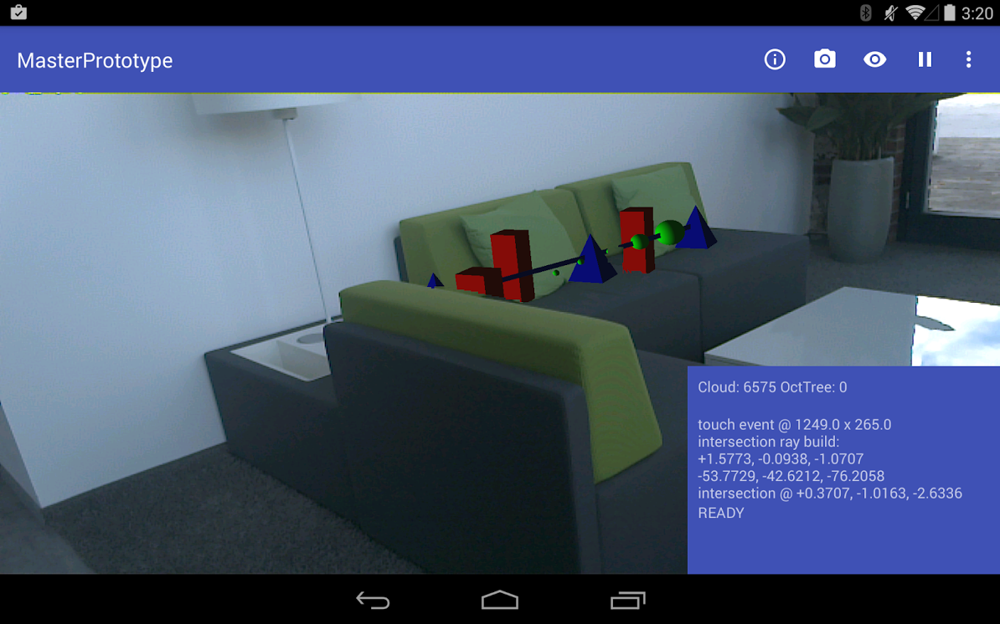
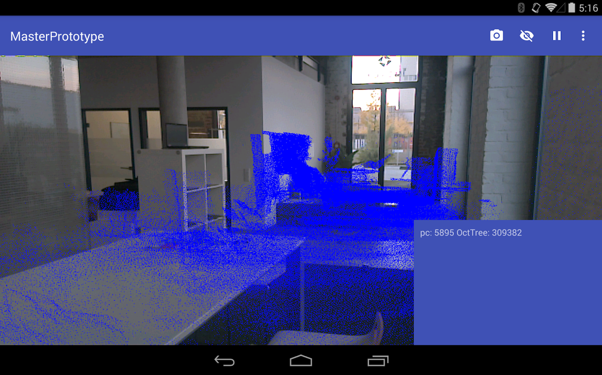
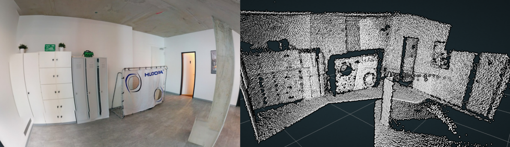
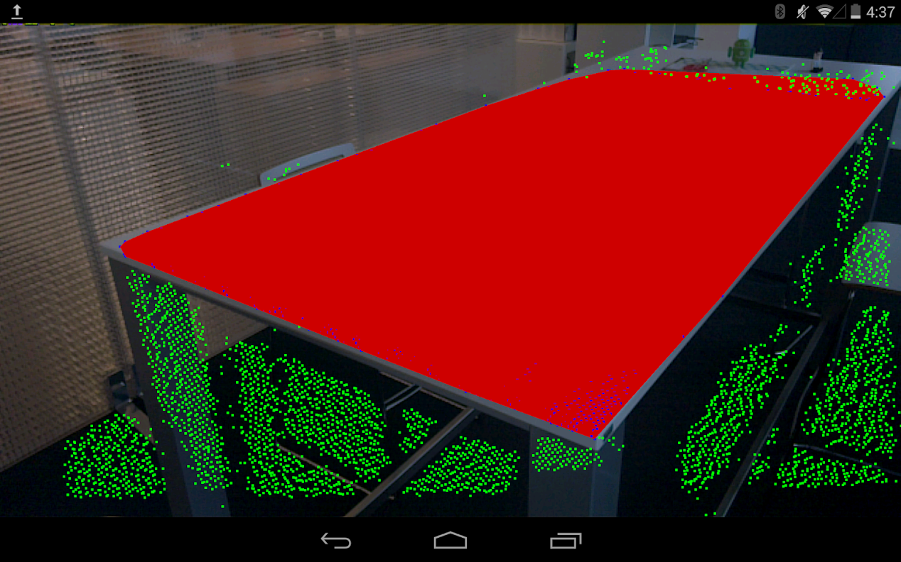
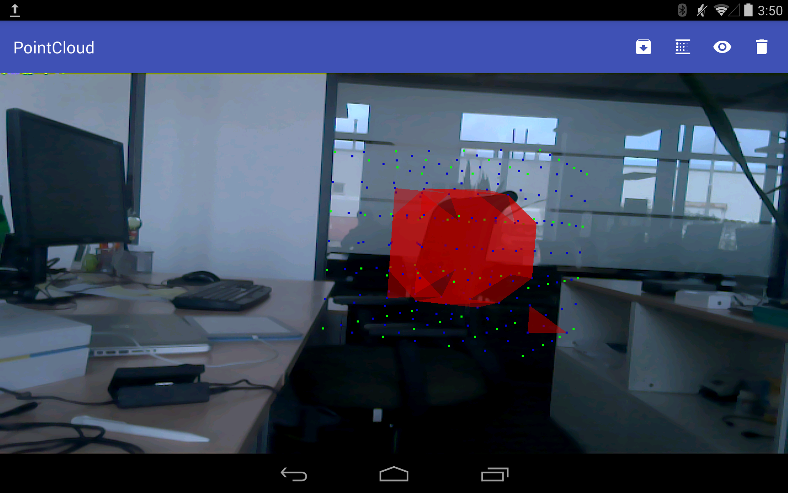
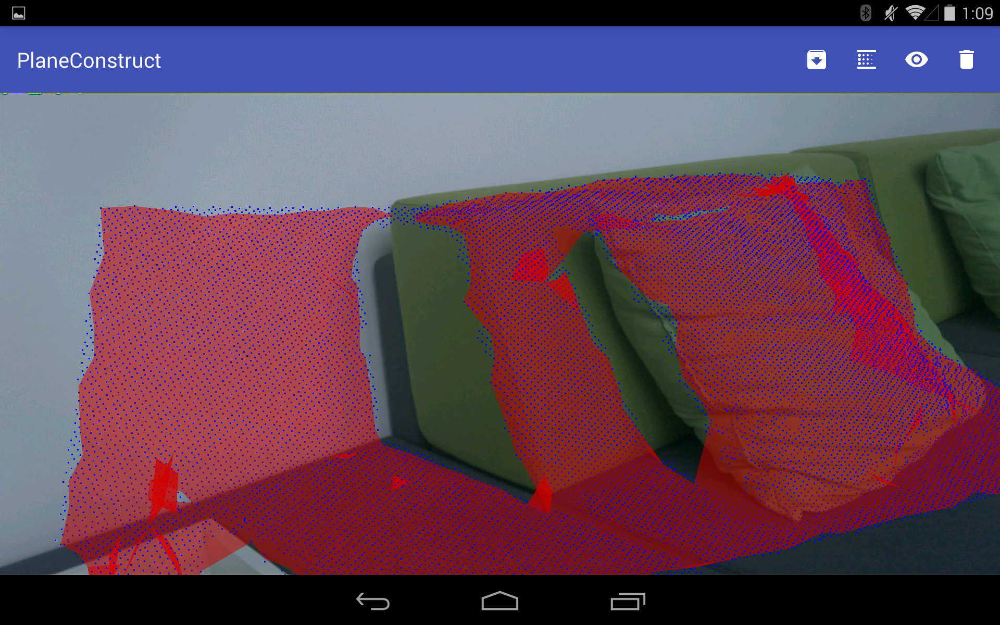
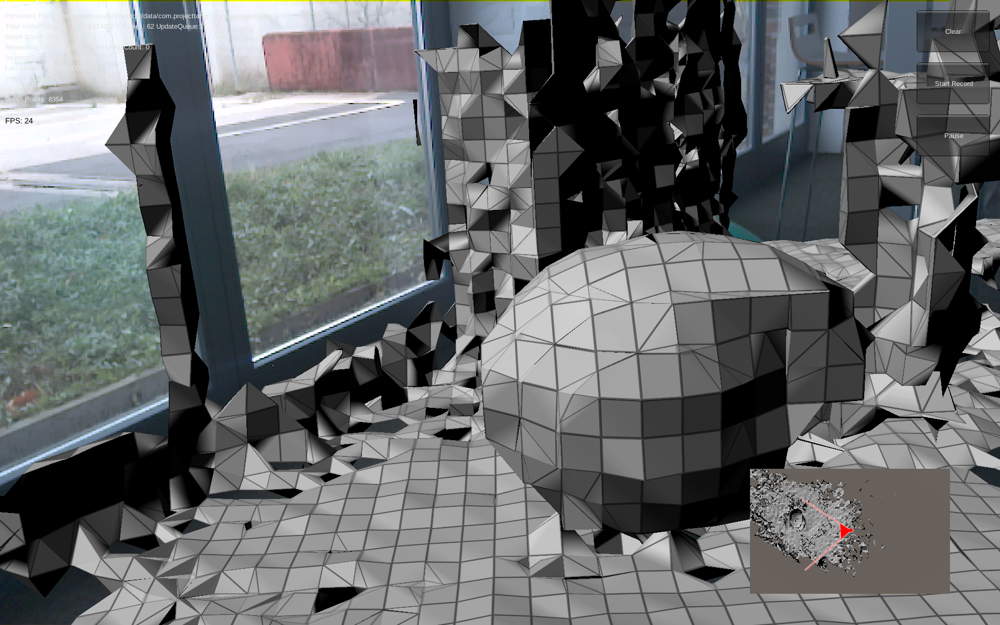
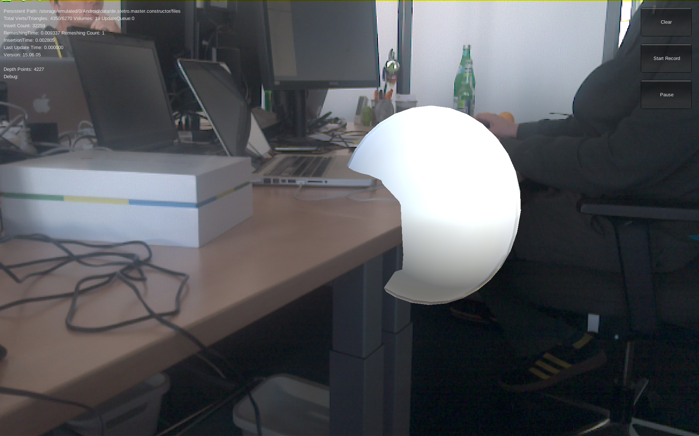

# PoC - Master Thesis 

> Optimierung von Augmented Reality Anwendungen durch die Berücksichtigung von Tiefeninformationen mit Googles Project Tango

### Aktuelles Featureset

#### Augmented Reality (ar/)
* Augmented Reality Kamera mit passenden Intrinsics
* Motion Tracking mit korrekter GL Positionierung
* Darstellung der aktuellen PointCloud Scene
* Ray Intersection für eine PointCloud Interaktion
* Simples Tower-Defense Spiel mit Ray Intersection (siehe Screenshot)
* Einfache Pointcloud Occlusion

#### Pointcloud App (pc/)
* Exporter der aufgenommenen PointCloud
* Sammeln von PointCloud ausschnitten in einem OctTree
* Reconstruction der OctTree Points mit der Methode aus 'construct'
* Reconstruction der OctTree Points durch Marching Cubes

#### Einfache Ebenen Erkennung (construct/)
* RANSAC Ebenen Suche in Pointcloud
* Feststellung der korellierenden Punkte
* KMean Cluster Extraction
* QuickHull für convexe Hüllen Erkennung der korellierenden Punkte eines Clusters
* Mesh generierung der convexen Hülle

#### Native Implementierung (construct-native/)
* Krosskompilierte [PCL]{http://pointclouds.org/} Anbindung 
* Voxel Grid downsampling
* Greedy Triangulation mit PCL

#### Unity Implementierung (unity/)
* Kombination der Experimental Beispiel aus Meshing und AR
* Implementierung von Clipping Depth Shader
* Einfaches Interaktives Beispiel zum Steuern eines Balls

### Verwendete Librarys
* [Rajawali](https://github.com/Rajawali/Rajawali)
* [tango-examples-java](https://github.com/googlesamples/tango-examples-java)
* [material-dialogs](https://github.com/afollestad/material-dialogs)
* [EventBus](https://github.com/greenrobot/EventBus)
* [commons-math3](https://commons.apache.org/math/)
* [jama](http://math.nist.gov/javanumerics/jama/)
* [QuickHull](https://github.com/Quickhull3d/quickhull3d)

