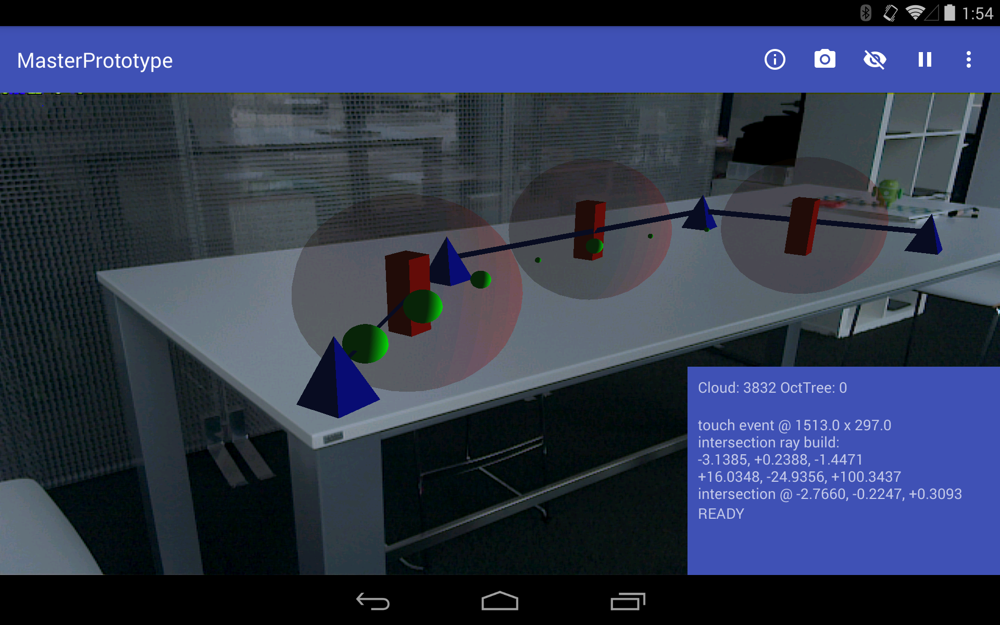

# PoC - Master Thesis 

> Optimierung von Augmented Reality Anwendungen durch die Berücksichtigung von Tiefeninformationen mit Googles Project Tango

### Aktuelles Featureset
* Augmented Reality Kamera mit passenden Intrinsics
* Motion Tracking mit korrekter GL Positionierung
* Darstellung der aktuellen PointCloud Scene
* Ray Intersection für eine PointCloud Interaktion
* Simples Tower-Defense Spiel mit Ray Intersection (siehe Screenshot)
* Sammeln von PointCloud ausschnitten in einem OctTree
* Exporter der aufgenommenen PointCloud

### Verwendete Librarys
* [Rajawali](https://github.com/Rajawali/Rajawali)
* [tango-examples-java](https://github.com/googlesamples/tango-examples-java)
* [material-dialogs](https://github.com/afollestad/material-dialogs)
* [EventBus](https://github.com/greenrobot/EventBus)
* [commons-math3](https://commons.apache.org/math/)
* [jama](http://math.nist.gov/javanumerics/jama/)

